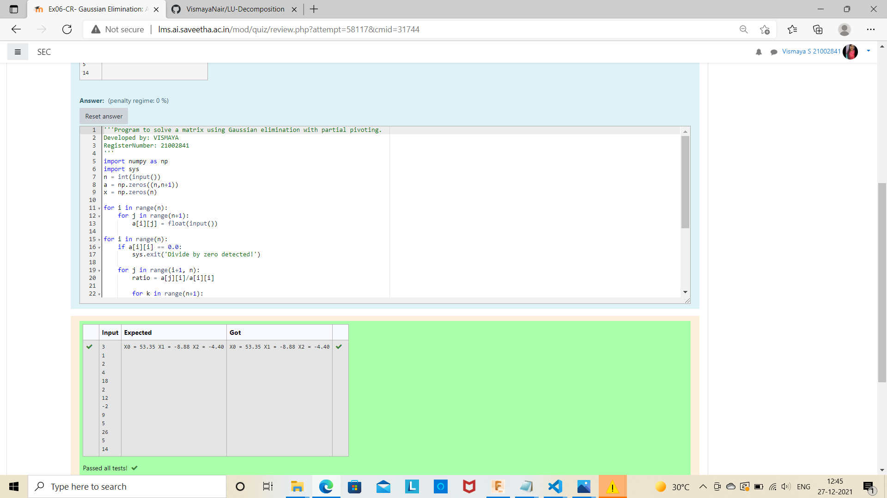

# Gaussian Elimination with partial pivoting

## AIM:
To write a program to find the Gaussian Elimination with partial pivoting of a matrix.

## Equipments Required:
1. Hardware – PCs
2. Anaconda – Python 3.7 Installation / Moodle-Code Runner

## Algorithm
1. Import numpy as np.
2. From scipy import lu.
3. Get the input from the user.
4. End the program. 

## Program:
```
/*
Program to find the Gaussian Elimination with partial pivoting of a matrix.
Developed by: VISMAYA
RegisterNumber: 21002841
*/
import numpy as np
import scipy
from scipy.linalg import lu
A = np.array (eval(input()))
P,L,U=lu(A)
print(L)
print(U)
 
import numpy as np
from scipy.linalg import lu_factor, lu_solve
A=eval(input())
B=eval(input())
lu,piv=lu_factor(A)
x=lu_solve((lu, piv), B)
print(x)
```

## Output:




## Result:
Thus the program to find the Gaussian Elimination with partial pivoting of a matrix is written and verified using python programming.

